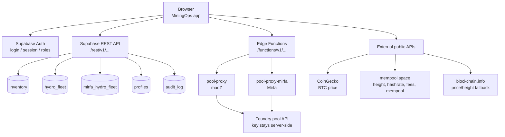
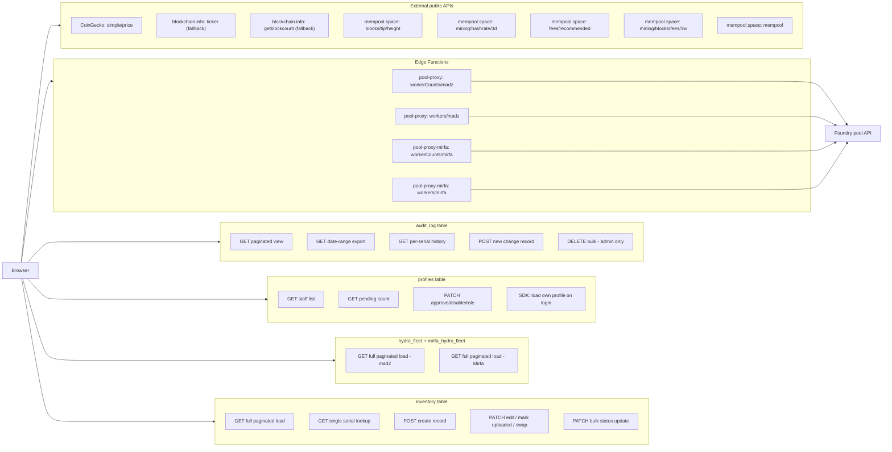

# MiningOps Portal — Endpoints Reference

## Flow overview



## Detailed endpoint flow

Every individual operation, grouped by resource:



All Supabase requests go to the project base URL:

```
https://agkaqrvsrptqusamihbw.supabase.co
```

Two kinds of Supabase endpoints are used: the built-in **REST API**
(PostgREST, auto-generated from database tables — path prefix
`/rest/v1/`) and custom **Edge Functions** (path prefix
`/functions/v1/`). A handful of external, free public APIs are used
for live market/mining context data.

---

## 1. Supabase Auth

Called via the Supabase JS SDK (`sb.auth.*`), not raw REST calls:

| Method | Purpose |
|---|---|
| `sb.auth.signInWithPassword` | Login |
| `sb.auth.signUp` | New account registration (lands as `pending`) |
| `sb.auth.signOut` | Logout |
| `sb.auth.getSession` | Restore/verify the current session on load |
| `sb.auth.updateUser` | Password change (forced first-login change, or self-service) |

**RPC (database) functions**, also called via the SDK (`sb.rpc(...)`):

| Function | Purpose |
|---|---|
| `bump_own_last_login` | Updates the caller's own `profiles.last_login` timestamp |
| `complete_password_reset` | Finalizes a password reset flow |

---

## 2. Supabase REST API (PostgREST) — `/rest/v1/...`

All requests carry the anon key (`apikey` header) and, for authenticated
calls, the current session's bearer token (`Authorization: Bearer <token>`)
via a shared `authFetch()` / `apiFetch()` helper. Row-Level Security on the
database enforces what each request is actually allowed to do server-side.

### `inventory` table
The shared table for both sites' miners plus PSU/Avalon-PSU records
(distinguished by `asset_type`).

| Example request | Used for |
|---|---|
| `GET inventory?select=*&order=serial.asc&limit=1000&offset={n}` | Full paginated load (main data fetch) |
| `GET inventory?select=serial,...` | Duplicate/serial lookups |
| `GET inventory?serial=eq.{serial}` | Single-serial lookup (e.g. serial history) |
| `POST inventory` | Create a record (Add Miner / Bulk Add / Import) |
| `PATCH inventory?id=eq.{id}` | Edit a single record / mark uploaded / swap |
| `PATCH inventory?id=in.({id1},{id2},...)` | Bulk status update (e.g. bulk swap) |

### `hydro_fleet` table
madZ's master Hydro-fleet IP list, used by the Antsentry Report to compare
against `inventory`.

| Example request | Used for |
|---|---|
| `GET hydro_fleet?select=*&order=ip_address.asc&limit=1000&offset={n}` | Full paginated load |

### `mirfa_hydro_fleet` table
Same idea as `hydro_fleet`, but for the Mirfa site.

| Example request | Used for |
|---|---|
| `GET mirfa_hydro_fleet?select=*&order=ip_address.asc&limit=1000&offset={n}` | Full paginated load |

### `profiles` table
One row per user — role, status, name, last login.

| Example request | Used for |
|---|---|
| `GET profiles?order=created_at.asc&select=*` | Staff Accounts list |
| `GET profiles?status=eq.pending&select=id` | Pending-approval count badge |
| `PATCH profiles?id=eq.{id}` | Approve/reject/disable/change role |
| `sb.from('profiles').select('*').eq('id', ...)` (SDK) | Load the current user's own profile after login |

### `audit_log` table
Every tracked field change across the app.

| Example request | Used for |
|---|---|
| `GET audit_log?select=*&order=changed_at.desc&limit={n}&offset={n}` | Paginated audit log view |
| `GET audit_log?select=*&changed_at=gte.{from}&changed_at=lte.{to}&order=changed_at.asc&limit=1000` | Date-range export |
| `GET audit_log?serial=eq.{serial}` | Per-serial history lookup |
| `POST audit_log` | Write a new change record |
| `DELETE audit_log?id=in.(...)` | Bulk delete (admin only) |

---

## 3. Supabase Edge Functions — `/functions/v1/...`

These proxy the Foundry pool API server-side, so the Foundry API key is
never present in the browser.

### `pool-proxy` (madZ)
Base: `{SUPABASE_URL}/functions/v1/pool-proxy`

| Path | Purpose |
|---|---|
| `GET /workers/workerCounts/{subaccount}?coin=BTC` | Summary counts (total / offline<15min / offline<24hr) for the topline stats |
| `GET /workers/{subaccount}?coin=BTC&pageSize=-1` | Full worker list (used by the table, exports, and Miner Monitoring's container grid) |

### `pool-proxy-mirfa` (Mirfa)
Base: `{SUPABASE_URL}/functions/v1/pool-proxy-mirfa`

| Path | Purpose |
|---|---|
| `GET /workers/workerCounts/mirfa?coin=BTC` | Same as above, Mirfa subaccount |
| `GET /workers/mirfa?coin=BTC&pageSize=-1` | Same as above, Mirfa subaccount |

---

## 4. External public APIs (no key required)

Used for the top-bar market/mining stat chips. All are free, keyless, and
explicitly allow-listed in the page's Content-Security-Policy.

### CoinGecko
| Endpoint | Used for |
|---|---|
| `GET https://api.coingecko.com/api/v3/simple/price?ids=bitcoin&vs_currencies=usd` | BTC price (primary source) → also feeds sats/$1 |

### blockchain.info
| Endpoint | Used for |
|---|---|
| `GET https://blockchain.info/ticker` | BTC price (fallback if CoinGecko fails) |
| `GET https://blockchain.info/q/getblockcount` | Block height (fallback) |

### mempool.space
| Endpoint | Used for |
|---|---|
| `GET https://mempool.space/api/blocks/tip/height` | Current block height (primary) |
| `GET https://mempool.space/api/v1/mining/hashrate/3d` | Global network hashrate |
| `GET https://mempool.space/api/v1/fees/recommended` | Next-block recommended fee (`fastestFee`) |
| `GET https://mempool.space/api/v1/mining/blocks/fees/1w` | Average fee per block (feeds the hashprice estimate) |
| `GET https://mempool.space/api/mempool` | Mempool congestion — unconfirmed transaction count |

**Hashprice** and **halving countdown** are computed client-side from
already-fetched data (block height, BTC price, hashrate, avg block fees) —
they are not their own API call.

---

## Content-Security-Policy — allowed connect-src

For reference, the exact set of domains the page is permitted to make
network requests to:

```
'self'
https://agkaqrvsrptqusamihbw.supabase.co
https://api.coingecko.com
https://blockchain.info
https://mempool.space
```

Any request to a domain outside this list will be blocked by the browser
regardless of what the JavaScript tries to do.
